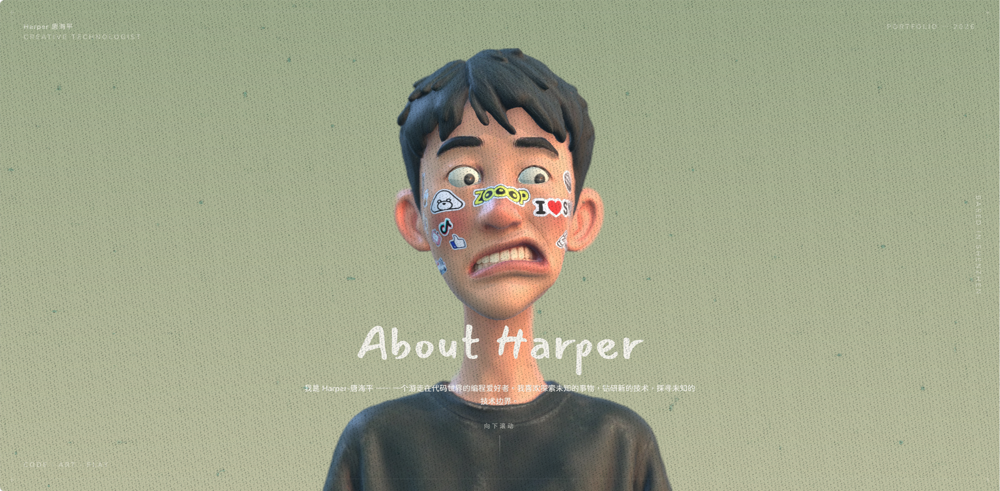

<h1 align="center">Harper’s Blog</h1>

<p align="center">
  
  
  
  
</p>

<p align="center">
  <a href="https://github.com/thp322"></a>
  <a href="https://harperwork.cn"></a>
</p>
<p align="center">
  <a href="https://harperwork.cn/">在线访问</a> |
  <a href="#技术栈">技术栈</a> |
  <a href="#项目结构">项目结构</a> |
  <a href="#快速开始">快速开始</a> |
  <a href="#素材替换">素材替换</a> |
  <a href="#人物模型">人物模型</a> |
  <a href="#工作原理">工作原理</a> |
  <a href="#技术特性">技术特性</a>
</p>
<p align="center">
  <a href="https://harperwork.cn/"></a>
</p>
## 技术栈

- **前端框架**: React 18 + TypeScript 5
- **3D 渲染**: three.js r169 + @react-three/fiber 8 + @react-three/drei 9
- **后期特效**: @react-three/postprocessing (DepthOfField / Bloom / SMAA)
- **动画**: framer-motion 11
- **状态管理**: zustand 4
- **内容渲染**: react-markdown + remark-gfm + rehype-raw
- **媒体播放**: hls.js (HLS 视频支持)
- **构建工具**: Vite 5
- **代码规范**: ESLint 10 + typescript-eslint
- **部署**: GitHub Actions → GitHub Pages

## 项目结构

```
web/
  src/
    App.tsx              Canvas + 滚动内容装配、首屏 About、加载/叠层
    main.tsx             入口
    store.ts             全局交互状态（zustand）
    data/
      works.ts           作品集板块 / 作品列表
      workDocs.ts        构建期内联 content/works/*.md + frontmatter 解析
      focusPoints.ts     时间轴对焦锚点名单
    content/works/       作品详情 markdown
    scene/
      Scene.tsx          3D 场景：人物模型 + glb 相机动画 + 滚动驱动 / 眼球跟随
      Env.tsx            env.hdr 环境光照（IBL）
    ui/
      Resume.tsx         履历时间轴
      Works.tsx          作品集画廊 + 详情弹窗
      LoadingScreen.tsx / NoiseOverlay.tsx / SocialIcons.tsx / ZooopLogo.tsx
  public/
    models/  fonts/  images/  textures/   静态素材
  scripts/compress-media.sh               媒体压缩脚本（ffmpeg，原地压缩）
```

## 快速开始

前端应用在 [`web/`](web) 目录下，所有代码路径相对 `web/`。

```bash
cd web
npm install
npm run dev        # 开发 http://localhost:5173
```

其他命令：

```bash
npm run build      # 类型检查 + 打包，产物输出到 dist/
npm run preview    # 预览 build 产物
npm run typecheck  # 仅类型检查（tsc -b）
npm run lint       # ESLint
```

**环境要求：** Node.js 20+。无后端、无数据库、无需任何 API key。

## 素材替换

内容与表现是分离的，改内容基本只动数据文件：

| 想改什么                                  | 改哪里                                                       |
| ----------------------------------------- | ------------------------------------------------------------ |
| 首屏 About 文案                           | `src/App.tsx` 里的 `COPY`                                    |
| 履历（学历 / 经历 / 客户 / 社交链接）     | `src/ui/Resume.tsx`                                          |
| 作品集板块与作品列表                      | `src/data/works.ts`                                          |
| 单个作品的详情正文                        | `src/content/works/<slug>.md`（frontmatter + markdown；格式见 `src/data/workDocs.ts`，示例见 `src/content/works/example.md`） |
| 履历条数 / 相机停靠点                     | `src/data/focusPoints.ts` 的 `FOCUS_POINTS`（要与 `Resume.tsx` 的 entries 同步增删） |
| 灯光 / 景深 / Bloom / 背景渐变 / 人物位置 | `src/scene/Scene.tsx` 里各组件顶部的**普通常量**，直接改值，没有面板也没有额外配置文件 |
| 人物模型                                  | `public/models/me.glb`，见 [换人物模型](https://github.com/dayinji/sen-3d-resume#换人物模型) |

作品详情用极简 markdown：每个作品一个 `.md`，通过 `works.ts` 里 item 的 `slug` 关联；没有对应 `.md` 的作品走统一占位详情。

## 人物模型

想换成人物模型，只需替换 `public/models/me.glb`，或改写 `src/scene/Scene.tsx` 用你自己的场景。代码按**对象名字**在 glb 里查找以下内容，缺哪个对应功能就失效：

| glb 里要有                             | 作用                                                         | 缺了会怎样                     |
| -------------------------------------- | ------------------------------------------------------------ | ------------------------------ |
| 相机 + 名为 `CameraAction` 的动画 clip | 滚动驱动的镜头路径；总帧数运行时按 24fps 从 clip 读，不写死  | 没有镜头运动，等于整个效果失效 |
| `focus-start`（或 `focus-0`）          | 首屏对焦锚点（空对象），两种命名都认                         | 首屏自动对焦失效               |
| 时间轴对焦锚点（每条履历一个空对象）   | 顺序列在 `src/data/focusPoints.ts` 的 `FOCUS_POINTS`——`Scene.tsx` 与 `Resume.tsx` 共用的唯一真源。**条数是动态的** | 对应节点对不上焦               |
| `focus-works`                          | 作品区对焦锚点（空对象），可选                               | 自动复用末时间轴锚点           |
| 名字含 `eye` 的网格                    | 眼睛（眼球跟随光标）                                         | 眼睛不动                       |

## 工作原理

纯前端 SPA，无后端、无路由：`index.html` → `src/main.tsx` → `src/App.tsx`（一个固定 `<Canvas>` 3D 背景 + 可滚动 HTML 叠层）。

- **3D 背景**：`src/scene/Scene.tsx` 加载 `public/models/me.glb`，用 glb 自带的相机动画分 5 段被滚动「刮」着播放，再叠自动对焦景深与眼球跟随；灯光来自 `src/scene/Env.tsx`（`public/textures/env.hdr` 做 IBL）。
- **滚动内容**：`Hero`（About，在 `App.tsx` 内）→ `src/ui/Resume.tsx`（履历时间轴）→ `src/ui/Works.tsx`（作品集画廊 + 详情弹窗）。
- **叠层效果**：`LoadingScreen`（模型加载完前的遮罩）、`NoiseOverlay`（胶片噪点）、滚动渐暗 / 磨砂右轨 / 首屏装饰画框（都在 `App.tsx`）。
- **后期管线**：`<EffectComposer>` 顺序为 DepthOfField → Bloom → SMAA。
- **全局状态**：`src/store.ts`（zustand，轻量）。

镜头与履历的对应关系，基于 glb 里 `CameraAction` 的帧约定（24fps）：

```
第 0 帧                                                          最后一帧
  │        │        │        │        │        │                    │
focus-0  focus-1  focus-2  focus-3  focus-4  focus-5  ···  ···  focus-works
首屏     ├─ 50 帧 ─┤ 每个时间轴节点相隔 50 帧            尾段 = 作品区（长度任意）
```

```ts
// src/data/focusPoints.ts
export const FOCUS_POINTS = ['focus-1', 'focus-2', 'focus-3', 'focus-4', 'focus-5'] as const
export const FRAMES_PER_NODE = 50
```

## 技术特性

- **滚动即运镜**：相机路径是 glb 里烘好的动画，滚动条只在时间轴上「刮」帧，比手写相机插值更自然
- **眼球跟随光标**：3D 模型眼球实时跟随鼠标位置，增添互动细节
- **自动对焦景深**：每条履历节点自动对焦，呈现电影级视觉效果
- **动态节点数**：履历条数不写死，`FOCUS_POINTS` 加一条，镜头区间自动适配
- **纯静态架构**：无后端、无路由、无 API key，产物可部署到任何地方
- **数据驱动**：内容与表现分离，修改数据文件即可更新，无需改动 3D 代码
- **后期渲染**：DepthOfField → Bloom → SMAA 合成管线，画面质感更佳
